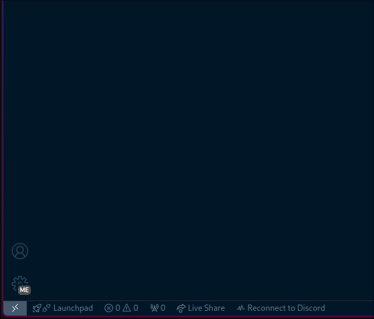
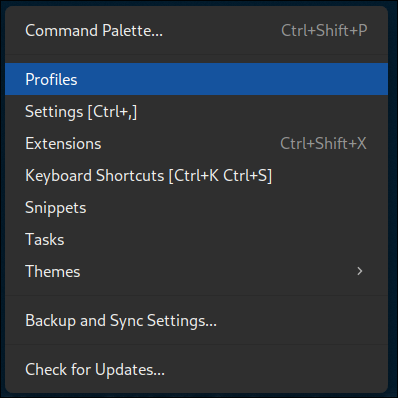
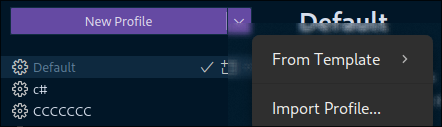
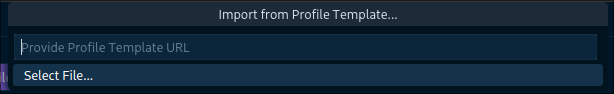

Merhabalar, Ticaret İstatistik topluluğunun ilk blog yazısına hoş geldiniz. Bu yazıda [İstanbul Ticaret Üniversitesi](https://ticaret.edu.tr) 2024-2025 eğitim öğretim dönemi kapsmanında **Veri Analizinde Bilgisayar Programlama 1 (IST235)** dersi alan öğrencilerin derste anlatılanları uygulayabilmeleri, verilen ödevleri yapabilmeleri ve ders sonrasında da çalışabilmeleri için gereken paket program, geliştirme ortamları ve editörlerin kurulum detaylarına değineceğiz.

<!--truncate-->

## Kurulum Aşamaları

- MiniConda (Python dahil)
- Visual Studio Code (VSCode)

### Windows

1. Windows üzerinde gerekli kurulumları gerçekleştirecek olan <a href="https://gist.githubusercontent.com/yigit433/dad44f953742f4858362696514a8475e/raw/0aa95f028939468587d70796502276ae0cde3598/script.ps1" target="_blank">komut dosyasını tarayıcınızda açın</a>
2. Açılan sekmede sayfaya sağ tıklayarak `Farklı Kaydet` seçeneğine tıklayın ve bilgisayarınızıa ilgili dosyayı kaydedin.
3. Bilgisayarınızındaki `Dosya Gezgini` uygulamasına girin ve `İndirilenler` klasörünü açın.
4. IDONTREMEMBERHOWCANIOPENAPOWERSHELLONTHEOPENDIRECTORY
5. Açılan Powershell penceresinde sırasıyla aşağıdaki komutları kullanın.

    ```powershell
    Set-ExecutionPolicy RemoteSigned -Scope Process
    ```

    ```powershell
    .\miniconda-vscode-windows.ps1
    ```

6. Çalışan komut dosyasının yönlendirmelerini takip edin.

Eğer bir hata mesajı görmediyseniz işlemler başarı ile gerçekleşmiş demektir.

Kodları çalıştırabileceğiniz ortam hazır, şimdi ise bir editöre ihtiyacınız olacak. Visual Studio Code yapılandırmasına erişmek için [tıklayın](#visual-studio-code)

---

### MacOS

1. MacOS üzerinde gerekli kurulumları gerçekleştirecek olan <a href="https://gist.githubusercontent.com/mertssmnoglu/dbb4546ba9924b142ac42203deb41e06/raw/54c3e7e748bdb636fc5d2047da723f8c3f672fac/miniconda-vscode-macos.sh" target="_blank">komut dosyasını tarayıcınızda açın</a>
2. Açılan sekmede sayfaya sağ tıklayarak `Farklı Kaydet` seçeneğine tıklayın ve bilgisayarınızıa ilgili dosyayı kaydedin.
3. Bilgisayarınızındaki `Dosyalar` uygulamasına girin ve `İndirilenler` klasörünü açın.
4. Bilgisayarınızdaan Finder'a veya Spotlight'a girin ve `Terminal` uygulamasını açın
    
5. Terminal uygulaması açıldığında karşınıza aşağıdaki gibi bir ekran çıktığından emin olun.
    
6. Açılan terminal ekranında, konumunuzu değiştirmek için aşağıdaki komutlardan sistem diliniz ile uyuşanı seçin.

    ```shell
    cd İndirilenler
    ```

    ```shell
    cd Downloads
    ```

7. İndirilenler klasörüne geçiş yaptıktan sonra aşağıdaki komutu çalıştırın ve komut dosyasının yönlendirmelerini takip edin. (Yönetici şifrenizi girmeniz gerekebilir.)

    ```shell
    sh ./miniconda-vscode-macos.sh
    ```

Eğer bir hata mesajı görmediyseniz işlemler başarı ile gerçekleşmiş demektir.

Kodları çalıştırabileceğiniz ortam hazır, şimdi ise bir editöre ihtiyacınız olacak. Visual Studio Code yapılandırmasına erişmek için [tıklayın](#visual-studio-code)

---

### Visual Studio Code

Eğer üst kısımda anlatılan işletim sistemine göre kurulum adımlarını takip ettiyseniz ve herhangi bir hata almadıysanız Visual Studio Code kurulumunuz gerçekleşmiş demektir. Python programlama dili ile kodlama yaparken işimize yarayacak olan bir takım eklentileri kurabilmemiz için gereken `Profil` dosyasını indirip editöre uygulanmasını sağlayacağız.

1. Eğer indirmediyseniz ilgili [vscode profil dosyasını tarayıcınızda açın](https://gist.githubusercontent.com/mertssmnoglu/7a82ec0e7a26c88b7adf6116e62ae80b/raw/3bf99820fafa3596ca7eddcdfb5f06f3b6de4e7d/ticaretistatistik.code-profile)
2. Açılan sekmede sayfaya sağ tıklayarak `Farklı Kaydet` seçeneğine tıklayın ve bilgisayarınızıa ilgili dosyayı kaydedin.
3. Daha önceden kurulumu gerçekleşmiş olan `Visual Studio Code` uygulamasına giriş yapın.
4. Sol alt köşedeki ayarlar ikonuna tıklayın.

    
5. Açılan menüde "Profiller" veya "Profiles" seçeneğini seçin.

    
6. "Yeni Profil" veya "New Profile" yazısının sağındaki alt ok simgesine tıklayın.

    
7. Açılan menüden "Profil Dahil Et" veya "Import Profile" seçeneğini seçin.
8. Açılan menüda "Dosya Seç" veya "Select File" yazısına tıklanır. Ardından açılan menüdan `ticaretistatistik.code-profile` dosyasını seçin.

    
9. Son olarak "Oluştur" veya "Create" butonuna tıklanır.

    

Tüm bu adımları başarıyla gerçekleştirdiyseniz artık hazırsınız demektir. Kendinize biraz zaman ayırabilir, sevdiğiniz bir içeceği içebilir ve bilgisayarınızda gerçekleşen değişikliklerin farkına varabilirsiniz. İyi kodlamalar 🙂
