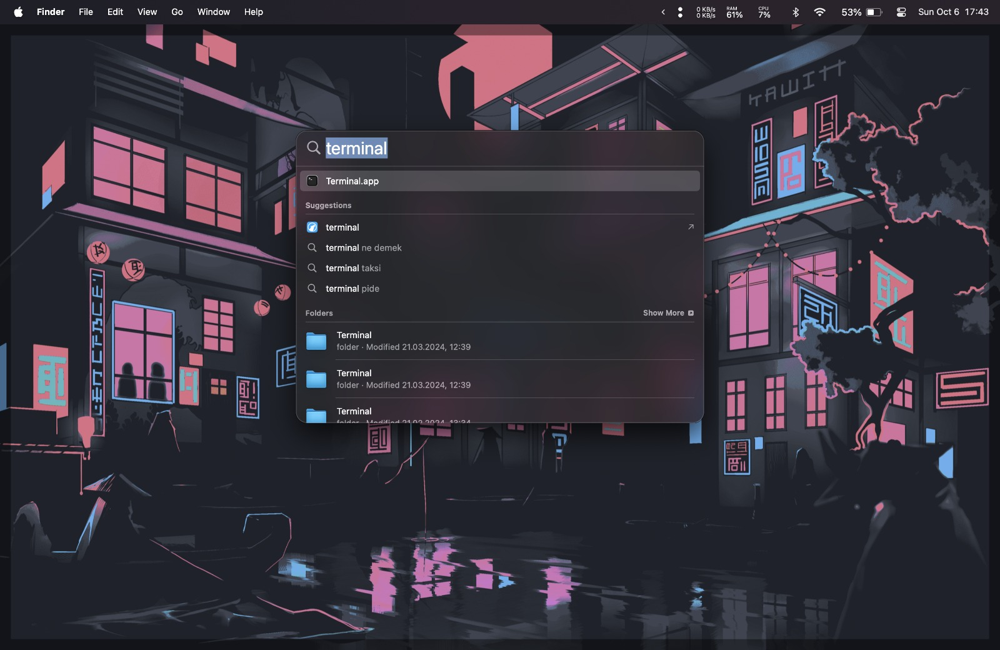

Merhabalar, Ticaret İstatistik topluluğunun ilk blog yazısına hoş geldiniz. Bu yazıda [İstanbul Ticaret Üniversitesi](https://ticaret.edu.tr) 2024-2025 eğitim öğretim dönemi kapsmanında **Veri Analizinde Bilgisayar Programlama 1 (IST235)** dersi alan öğrencilerin derste anlatılanları uygulayabilmeleri, verilen ödevleri yapabilmeleri ve ders sonrasında da çalışabilmeleri için gereken paket program, geliştirme ortamları ve editörlerin kurulum detaylarına değineceğiz.

<!--truncate-->

## Kurulum Aşamaları

- MiniConda (Python dahil)
- Visual Studio Code (VSCode)

### Windows

1. Windows üzerinde gerekli kurulumları gerçekleştirecek olan <a href="https://gist.githubusercontent.com/yigit433/dad44f953742f4858362696514a8475e/raw/0aa95f028939468587d70796502276ae0cde3598/script.ps1" target="_blank">komut dosyasını tarayıcınızda açın</a>
2. Açılan sekmede sayfaya sağ tıklayarak `Farklı Kaydet` seçeneğine tıklayın ve bilgisayarınızıa ilgili dosyayı kaydedin.
3. Bilgisayarınızındaki `Dosya Gezgini` uygulamasına girin ve `İndirilenler` klasörünü açın.
4. IDONTREMEMBERHOWCANIOPENAPOWERSHELLONTHEOPENDIRECTORY
5. Açılan Powershell penceresinde sırasıyla aşağıdaki komutları kullanın.

    ```powershell
    Set-ExecutionPolicy RemoteSigned -Scope Process
    ```

    ```powershell
    .\miniconda-vscode-windows.ps1
    ```

6. Çalışan komut dosyasının yönlendirmelerini takip edin.

Eğer bir hata mesajı görmediyseniz işlemler başarı ile gerçekleşmiş demektir. Kendinize biraz zaman ayırabilir, sevdiğiniz bir içeceği içebilir ve bilgisayarınızda gerçekleşen değişikliklerin farkına varabilirsiniz. İyi kodlamalar 🙂

---

### MacOS

1. MacOS üzerinde gerekli kurulumları gerçekleştirecek olan <a href="https://gist.githubusercontent.com/mertssmnoglu/dbb4546ba9924b142ac42203deb41e06/raw/54c3e7e748bdb636fc5d2047da723f8c3f672fac/miniconda-vscode-macos.sh" target="_blank">komut dosyasını tarayıcınızda açın</a>
2. Açılan sekmede sayfaya sağ tıklayarak `Farklı Kaydet` seçeneğine tıklayın ve bilgisayarınızıa ilgili dosyayı kaydedin.
3. Bilgisayarınızındaki `Dosyalar` uygulamasına girin ve `İndirilenler` klasörünü açın.
4. Bilgisayarınızdaan Finder'a veya Spotlight'a girin ve `Terminal` uygulamasını açın
    
5. Terminal uygulaması açıldığında karşınıza aşağıdaki gibi bir ekran çıktığından emin olun.
    
6. Açılan terminal ekranında `cd İndirilenler` veya `cd Downloads` yazarak indirme yaptığınız klasöre geçiş yapın.
7. İndirilenler klasörüne geçiş yaptıktan sonra `sh ./miniconda-vscode-macos.sh` komutunu çalıştırın ve komut dosyasının yönlendirmelerini takip edin.

Eğer bir hata mesajı görmediyseniz işlemler başarı ile gerçekleşmiş demektir. Kendinize biraz zaman ayırabilir, sevdiğiniz bir içeceği içebilir ve bilgisayarınızda gerçekleşen değişikliklerin farkına varabilirsiniz. İyi kodlamalar 🙂
