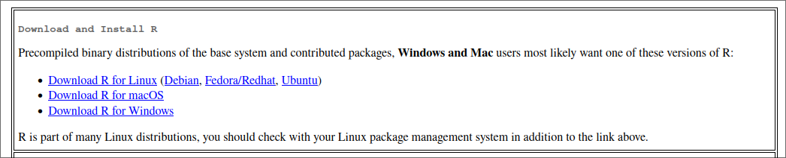
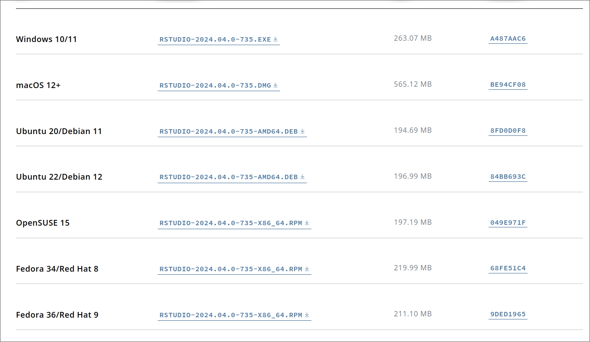

# R ile Çalışabilmek için Gerekli Kurulumlar

R ile çalışmak için bilgisayarımıza birkaç kurulum yapmamız gerekiyor. R, bir programlama dili ve yazılım ortamıdır. R Studio ise R ile çalışmak için geliştirilmiş bir IDE'dir.

İki yazılım da açık kaynak kodlu ve özgür yazılımlardır. Kullanım ücreti ödemeden, ekstra lisanslama ile uğraşmadan kullanabilirsiniz. Bunun yanında R Studio'nun ücretli versiyonu da bulunmaktadır ancak bu dökümanda ücretsiz olan versiyonu anlatılacaktır.

## R Kurulumu

### R İndirme Bağlantısı

R'ın kurulum dosyasınının dağıtımı birçok farklı ülke tarafından yapılmaktadır. Bu nedenle R'ı indirirken, bulunduğunuz ülkeye en yakın sunucuyu seçmeniz daha hızlı bir indirme işlemi sağlayacaktır. Türkiye için kurulum dosyaları [İstanbul Gedik Üniversitesi](https://cran.gedik.edu.tr/) ve [Denizli Pamukkale Üniversitesi](https://cran.pau.edu.tr/) tarafından dağıtılmaktadır.

İstanbul'da bulunduğumuz için [İstanbul Gedik Üniversitesi](https://cran.gedik.edu.tr/) sunucusundan indirme işlemi yapacağız.

### İşletim Sistemi Seçimi

İşletim sisteminize uygun olan en son sürüme tıklayın.



- **Windows** için `base` seçeneğini seçin.
- **Mac** için, eğer M serisi bir işlemciye sahipseniz `arm64` seçeneğini seçin. Eğer intel işlemciye sahipseniz`x86_64` seçeneğini seçin.
- **Linux** için uygun olan seçeneği seçin.

#### Linux için Komut Satırı ile Kurulum

Debian/Ubuntu

```shell
sudo apt-get install r-base 
```

Arch Linux

```shell
sudo pacman -S r
```

İndirme işlemleriniz bittikten sonra bilgisayarınızda R çalıştırabilir duruma geleceksiniz.

## R Studio Kurulumu

### R Studio İndirme Bağlantısı

R Studio'nun indirme bağlantısına [buradan](https://posit.co/download/rstudio-desktop/) ulaşabilirsiniz.

### İşletim Sistemi Seçimi

İşletim sisteminize uygun olan en son sürüme tıklayın.



İndirdiğiniz dosyası yükledikten sonra R Studio bilgisayarınıza kurulmuş olacak. Artık R ve R Studio'yu kullanmaya başlayabilirsiniz.
